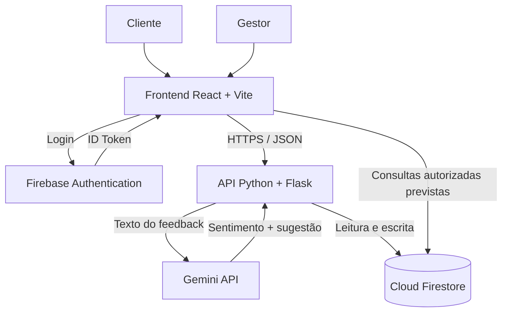
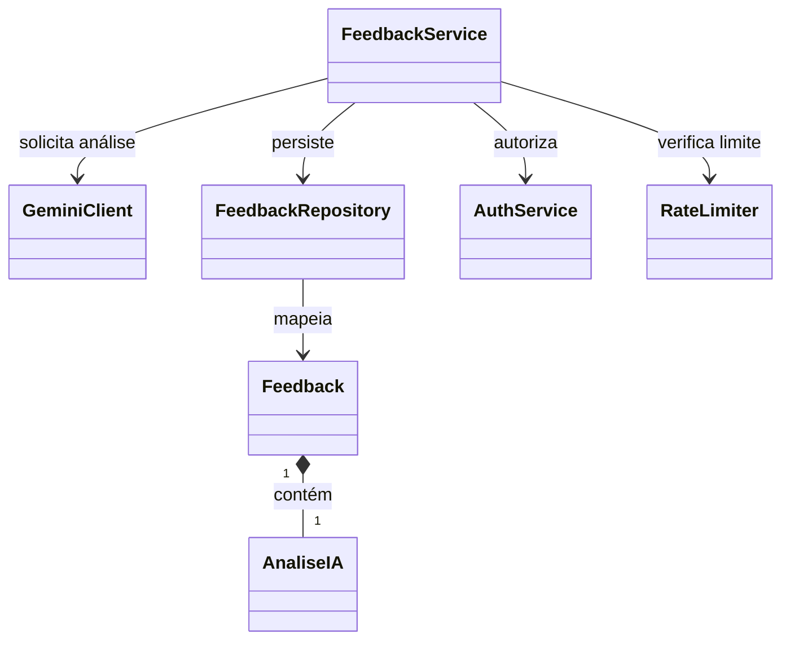
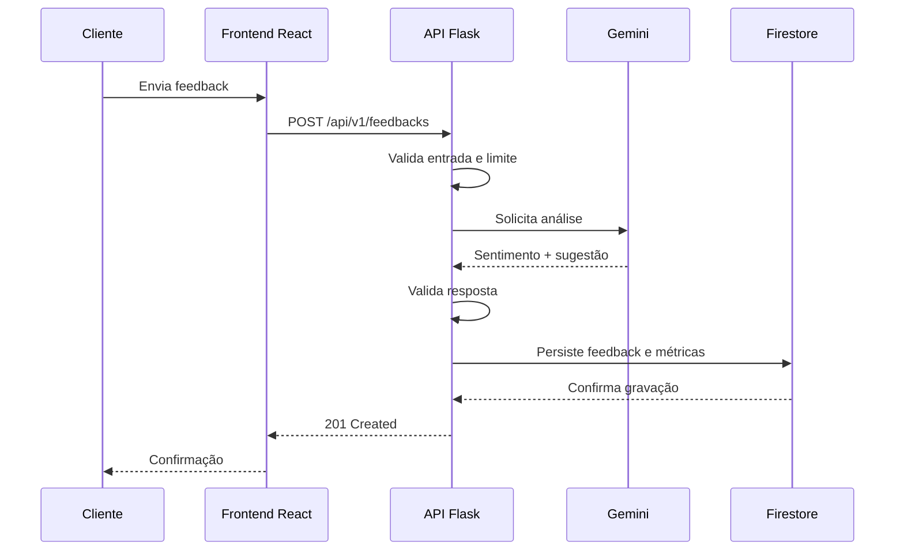

# VozDoCliente IA

> Plataforma acadêmica para coleta, análise e gestão de feedbacks de clientes com apoio de Inteligência Artificial.

**Disciplina:** Computação em Nuvem — UNIFAN, 2026.2  
**Equipe:** Rijkaard de Sousa de Andrade, Erik Nogueira, Diego Paim e Rafael  
**Status:** Em desenvolvimento  
**Revisão deste README:** 01/10/2026

---

## Sumário

1. [Visão Geral e Diferenciais](#1-visão-geral-e-diferenciais)
2. [Jornadas de Usuário e Usabilidade](#2-jornadas-de-usuário-e-usabilidade)
3. [System Design e Arquitetura Cloud](#3-system-design-e-arquitetura-cloud)
4. [Segurança e Gestão de Acessos](#4-segurança-e-gestão-de-acessos)
5. [Plano de Escalonamento](#5-plano-de-escalonamento)
6. [Estrutura de Banco de Dados](#6-estrutura-de-banco-de-dados)
7. [Design de Software e UML](#7-design-de-software-e-uml)
8. [Design e Documentação da API REST](#8-design-e-documentação-da-api-rest)
9. [Estratégia de Testes](#9-estratégia-de-testes)
10. [DevOps, CI/CD e Organização do Repositório](#10-devops-cicd-e-organização-do-repositório)
11. [Custos e Monitoramento](#11-custos-e-monitoramento)
12. [Como executar o projeto](#12-como-executar-o-projeto)
13. [Referências técnicas](#13-referências-técnicas)

---

# 1. Visão Geral e Diferenciais

## 1.1 Contexto e problema

Pequenos estabelecimentos de comércio e serviços recebem elogios, reclamações e sugestões de clientes, mas muitas vezes precisam analisar manualmente cada mensagem para identificar problemas recorrentes e decidir como agir.

O **VozDoCliente IA** propõe uma plataforma própria para receber, organizar e analisar esses feedbacks. O sistema utilizará uma API de Inteligência Artificial para classificar o sentimento do texto e gerar uma sugestão de plano de ação para o gestor.

O primeiro protótipo será voltado para um único estabelecimento e utilizará dados fictícios durante a demonstração acadêmica.

## 1.2 Objetivo

O fluxo principal do sistema será:

1. receber um feedback pelo frontend;
2. validar os dados enviados;
3. encaminhar somente o texto necessário para a API de IA;
4. classificar o sentimento como `POSITIVO`, `NEGATIVO` ou `NEUTRO`;
5. gerar uma sugestão de ação;
6. validar a resposta da IA;
7. armazenar o resultado;
8. disponibilizar as informações no painel do gestor.

A sugestão produzida pela IA será apenas uma recomendação. A aplicação não executará ações externas automaticamente.

## 1.3 Diferencial

Além de classificar o sentimento, o sistema irá propor uma ação relacionada ao feedback.

Exemplo:

> Feedback: "O atendimento foi bom, mas demorou muito."  
> Sentimento: `NEGATIVO`  
> Sugestão: revisar a distribuição dos atendimentos nos horários de maior movimento.

## 1.4 Requisitos funcionais

| Código | Funcionalidade | Critério de aceitação |
|---|---|---|
| RF01 | Receber nome opcional e feedback | Rejeitar texto vazio e confirmar somente após persistência. |
| RF02 | Classificar sentimento | Aceitar somente `POSITIVO`, `NEGATIVO` ou `NEUTRO`. |
| RF03 | Gerar plano de ação | Armazenar e apresentar uma sugestão textual validada. |
| RF04 | Autenticar gestores | Restringir consultas e alterações a usuários autorizados. |
| RF05 | Exibir painel | Mostrar feedbacks recentes e totais por sentimento. |
| RF06 | Consultar histórico | Oferecer paginação e consulta individual. |
| RF07 | Acompanhar ações | Permitir `PENDENTE`, `EM_ANALISE` ou `CONCLUIDO`. |
| RF08 | Excluir feedback | Exigir gestor autenticado e confirmação. |
| RF09 | Documentar e testar API | Manter contrato OpenAPI e roteiro de testes. |

## 1.5 Fora do escopo inicial

Não fazem parte do MVP:

- integração com WhatsApp;
- suporte a múltiplas empresas;
- cobrança;
- envio automático de mensagens;
- treinamento de modelo próprio;
- execução automática dos planos sugeridos pela IA.

## 1.6 Situação atual

### Concluído

- [x] Definição do projeto e do diferencial.
- [x] Criação do repositório.
- [x] Planejamento técnico inicial.
- [x] Criação da base do frontend com **React + Vite**.
- [x] Configuração inicial de lint com **Oxlint**.
- [x] Estrutura local instalada e validada com `npm run dev`.

### Próximas etapas

- [ ] Desenvolver as telas do frontend.
- [ ] Implementar o backend/API.
- [ ] Integrar Firebase Authentication.
- [ ] Integrar Cloud Firestore.
- [ ] Integrar Gemini API.
- [ ] Criar testes.
- [ ] Criar pipeline de CI/CD.
- [ ] Realizar deploy.
- [ ] Registrar evidências de testes, deploy e consumo.

---

# 2. Jornadas de Usuário e Usabilidade

## 2.1 Envio de feedback pelo cliente

1. O cliente acessa o formulário.
2. Informa um nome opcional e o feedback.
3. O frontend valida os campos.
4. Durante o envio, o botão fica temporariamente desabilitado.
5. A API valida novamente a entrada.
6. A API solicita a análise à IA.
7. O resultado é validado e persistido.
8. O cliente recebe a confirmação somente depois do armazenamento.

Caso ocorra erro, o conteúdo digitado deve permanecer disponível para uma nova tentativa.

## 2.2 Acesso do gestor

1. O gestor realiza login.
2. O Firebase Authentication fornece um ID token.
3. O sistema verifica se o usuário possui autorização de gestor.
4. O painel apresenta os feedbacks recentes.
5. O gestor pode consultar detalhes e atualizar o status da ação.
6. O histórico é carregado de forma paginada.

## 2.3 Usabilidade e acessibilidade

A interface deverá utilizar:

- campos com rótulos claros;
- navegação por teclado;
- foco visível;
- mensagens de erro textuais;
- indicação de carregamento;
- classificação acompanhada de texto, não apenas de cor;
- confirmação antes de operações destrutivas.

Conteúdo recebido do cliente e produzido pela IA deverá ser exibido como texto, sem execução de HTML fornecido pelo usuário.

---

# 3. System Design e Arquitetura Cloud

## 3.1 Stack principal

| Camada | Tecnologia | Responsabilidade |
|---|---|---|
| Frontend | **React + Vite** | Formulário, autenticação e painel. |
| Linguagem do frontend | JavaScript | Lógica da interface. |
| Qualidade do frontend | Oxlint | Análise estática e padronização. |
| Hospedagem | Vercel | Publicação do frontend e serviços compatíveis com o projeto. |
| Backend/API | Python 3.12 + Flask | Validação, autorização, integração com IA e persistência. |
| Inteligência Artificial | Google Gemini API | Classificação do sentimento e geração da sugestão. |
| Banco | Cloud Firestore | Feedbacks, métricas e controles compartilhados. |
| Autenticação | Firebase Authentication | Login e emissão de tokens para gestores. |
| Repositório | GitHub | Versionamento e colaboração. |
| CI/CD | GitHub Actions | Testes e automação de publicação. |

> **Importante:** React + Vite substitui a interface originalmente planejada apenas com HTML, CSS e JavaScript puro. O backend continua independente e poderá ser consumido pelo frontend por HTTP.

## 3.2 Arquitetura lógica



## 3.3 Responsabilidades

### Frontend

Responsável por:

- formulário de feedback;
- login do gestor;
- painel;
- validações de experiência de usuário;
- consumo da API;
- apresentação de estados de carregamento e erro.

### Backend

Responsável por:

- validação definitiva da entrada;
- autorização;
- integração com a IA;
- validação da resposta da IA;
- persistência;
- paginação;
- atualização de status;
- exclusão;
- rate limiting;
- padronização de erros.

## 3.4 Comunicação

As comunicações externas deverão utilizar HTTPS.

A API utilizará JSON e rotas versionadas em `/api/v1`.

O frontend não deverá possuir credenciais administrativas do Firebase nem a chave privada da Gemini API.

---

# 4. Segurança e Gestão de Acessos

## 4.1 Autenticação

O envio de feedback poderá ser público, sujeito a validações e limites de uso.

Operações administrativas exigirão autenticação.

O backend deverá receber:

```http
Authorization: Bearer <ID_TOKEN>
```

O token será validado antes da execução de operações protegidas.

## 4.2 Autorização

O perfil de gestor poderá ser representado por uma custom claim:

```text
gestor: true
```

Comportamento previsto:

- token ausente, inválido ou expirado → `401 Unauthorized`;
- usuário autenticado sem perfil necessário → `403 Forbidden`.

Não haverá rota pública capaz de conceder privilégio de gestor.

## 4.3 Dados e credenciais

Nunca devem ser enviados para o GitHub:

- `GEMINI_API_KEY`;
- credenciais administrativas do Firebase;
- tokens;
- senhas;
- secrets do deploy;
- arquivos `.env` reais.

O repositório deverá conter apenas um `.env.example` sem valores secretos.

## 4.4 Dados enviados à IA

O nome opcional do cliente não será enviado ao Gemini.

Logs também não deverão armazenar:

- tokens;
- chaves;
- senhas;
- nomes de clientes;
- conteúdo integral de feedbacks quando não for necessário.

Para a demonstração serão utilizados dados fictícios.

---

# 5. Plano de Escalonamento

## 5.1 Estratégia inicial

A primeira versão será um MVP acadêmico.

A aplicação não dependerá de estado mantido apenas na memória do backend. Informações compartilhadas deverão permanecer em armazenamento persistente.

O principal limite externo esperado será a cota disponível da API de IA.

## 5.2 Limites iniciais propostos

| Parâmetro | Valor inicial de planejamento |
|---|---:|
| Feedback | 10 a 2.000 caracteres |
| Chamadas globais à IA | até 5/minuto |
| Chamadas globais à IA | até 100/dia |
| Timeout da IA | 20 segundos |
| Registros recentes no painel | 50 |
| Retry automático no MVP | não |

Esses valores são **decisões de projeto**, não limites garantidos pelos provedores.

Antes do deploy, deverão ser ajustados de acordo com as cotas efetivamente disponíveis.

## 5.3 Evolução

Caso o processamento síncrono se torne inadequado, uma evolução possível será:

```text
Frontend
   ↓
API
   ↓
Fila
   ↓
Worker
   ↓
Gemini
   ↓
Firestore
```

Nesse cenário, o cliente poderá receber `202 Accepted` e consultar o processamento por identificador.

Essa arquitetura não faz parte do MVP atual.

---

# 6. Estrutura de Banco de Dados

## 6.1 Modelo

Será utilizado **Cloud Firestore**, com documentos NoSQL.

Coleção principal:

```text
feedbacks
```

## 6.2 Documento de feedback

| Campo | Tipo | Regra |
|---|---|---|
| `cliente_nome` | String ou null | Opcional, até 80 caracteres. |
| `texto_original` | String | Obrigatório, entre 10 e 2.000 caracteres. |
| `sentimento_ia` | String | `POSITIVO`, `NEGATIVO` ou `NEUTRO`. |
| `plano_acao_ia` | String | Sugestão gerada e validada. |
| `status_acao` | String | `PENDENTE`, `EM_ANALISE` ou `CONCLUIDO`. |
| `modelo_ia` | String | Modelo utilizado na análise. |
| `versao_prompt` | String | Versão do prompt. |
| `criado_em` | Timestamp | Gerado pelo servidor. |
| `atualizado_em` | Timestamp | Gerado pelo servidor. |
| `atualizado_por` | String ou null | UID do gestor responsável. |

## 6.3 Documentos auxiliares

### Métricas

```text
metricas/geral
```

Campos planejados:

```text
total
positivo
negativo
neutro
atualizado_em
```

### Rate limit

```text
rate_limits/{chave}
```

Campos planejados:

```text
contagem
janela_inicio
expira_em
```

---

# 7. Design de Software e UML

## 7.1 Componentes do backend

| Componente | Responsabilidade |
|---|---|
| `Feedback` | Representar e validar o feedback. |
| `AnaliseIA` | Representar a resposta validada da IA. |
| `FeedbackService` | Coordenar regras do fluxo principal. |
| `GeminiClient` | Encapsular a integração com a Gemini API. |
| `FeedbackRepository` | Encapsular acesso ao Firestore. |
| `AuthService` | Validar token e autorização. |
| `RateLimiter` | Aplicar limites de uso. |

## 7.2 Diagrama de classes planejado



## 7.3 Sequência principal



---

# 8. Design e Documentação da API REST

## 8.1 Base

```text
/api/v1
```

## 8.2 Rotas planejadas

| Método | Rota | Acesso | Objetivo |
|---|---|---|---|
| `GET` | `/api/v1/health` | Público | Verificar disponibilidade. |
| `POST` | `/api/v1/feedbacks` | Público e limitado | Criar feedback. |
| `GET` | `/api/v1/feedbacks` | Gestor | Listar feedbacks. |
| `GET` | `/api/v1/feedbacks/{id}` | Gestor | Consultar um feedback. |
| `PATCH` | `/api/v1/feedbacks/{id}/status` | Gestor | Atualizar status. |
| `DELETE` | `/api/v1/feedbacks/{id}` | Gestor | Excluir feedback. |
| `GET` | `/api/v1/dashboard/metricas` | Gestor | Consultar métricas. |
| `GET` | `/openapi.json` | Público | Expor contrato da API. |
| `GET` | `/docs` | Público | Interface de documentação. |

## 8.3 Exemplo de requisição

```json
{
  "nome": "Cliente de teste",
  "texto": "O atendimento foi cordial, mas esperei muito para ser atendido."
}
```

## 8.4 Exemplo de análise interna

```json
{
  "sentimento": "NEGATIVO",
  "plano_acao": "Revisar a distribuição dos atendimentos nos horários de maior movimento."
}
```

## 8.5 Exemplo de resposta pública

```json
{
  "data": {
    "id": "identificador-gerado",
    "mensagem": "Feedback recebido e registrado."
  },
  "request_id": "identificador-da-requisicao"
}
```

## 8.6 Padrão de erro

```json
{
  "error": {
    "code": "FEEDBACK_INVALIDO",
    "message": "O texto deve ter entre 10 e 2000 caracteres."
  },
  "request_id": "identificador-da-requisicao"
}
```

## 8.7 Códigos HTTP previstos

| HTTP | Situação |
|---:|---|
| `400` | JSON malformado ou parâmetros inválidos. |
| `401` | Token ausente, inválido ou expirado. |
| `403` | Usuário sem autorização. |
| `404` | Recurso inexistente. |
| `413` | Corpo acima do limite. |
| `415` | Tipo de conteúdo incorreto. |
| `422` | Campos inválidos. |
| `429` | Limite de uso atingido. |
| `502` | Resposta inválida do serviço de IA. |
| `503` | Dependência temporariamente indisponível. |
| `504` | Tempo de análise excedido. |

---

# 9. Estratégia de Testes

## 9.1 Frontend

Serão testados:

- validações de formulário;
- estados de carregamento;
- tratamento de erro;
- autenticação;
- consumo da API;
- atualização do painel.

## 9.2 Backend

Os testes unitários deverão cobrir:

- validação do feedback;
- valores permitidos de sentimento;
- validação da resposta da IA;
- regras de status;
- autorização;
- rate limit;
- tradução de erros.

Chamadas externas deverão ser substituídas por mocks nos testes unitários.

## 9.3 Integração

Serão verificados:

- persistência;
- paginação;
- métricas;
- autenticação;
- Security Rules;
- comportamento do rate limit.

## 9.4 Cenários de ponta a ponta

| Cenário | Resultado esperado |
|---|---|
| Feedback válido | Persistir e confirmar. |
| IA retorna resposta inválida | Não persistir análise inconsistente. |
| IA excede timeout | Retornar erro controlado. |
| Banco falha | Não anunciar sucesso. |
| Usuário comum tenta abrir painel | Negar acesso. |
| Gestor altera status | Persistir status e responsável. |
| Gestor exclui feedback | Remover registro e corrigir métricas. |
| Limite é ultrapassado | Retornar `429`. |

## 9.5 Evidências

O repositório deverá guardar evidências sem dados sensíveis, como:

```text
docs/evidencias/
```

Exemplos:

- capturas de testes;
- exemplos do Postman;
- evidências do banco;
- execução do pipeline;
- evidência do deploy;
- registros de consumo.

---

# 10. DevOps, CI/CD e Organização do Repositório

## 10.1 Estrutura atual do frontend

A base já criada com React + Vite possui a organização inicial típica:

```text
VozDoCliente-IA/
├── public/
├── src/
├── .gitignore
├── index.html
├── package.json
├── package-lock.json
├── vite.config.js
└── README.md
```

Arquivos de configuração adicionais gerados pelo template, inclusive configuração de lint, devem permanecer versionados.

## 10.2 Estrutura alvo do projeto

À medida que a implementação avançar, a organização recomendada é:

```text
VozDoCliente-IA/
│
├── public/
│
├── src/
│   ├── assets/
│   ├── components/
│   ├── pages/
│   ├── services/
│   ├── App.jsx
│   └── main.jsx
│
├── backend/
│   ├── app.py
│   ├── routes/
│   ├── services/
│   ├── repositories/
│   ├── integrations/
│   └── models/
│
├── tests/
│   ├── unit/
│   └── integration/
│
├── docs/
│   ├── openapi.yaml
│   └── evidencias/
│
├── .github/
│   └── workflows/
│       ├── ci.yml
│       └── deploy.yml
│
├── .env.example
├── .gitignore
├── firestore.rules
├── firestore.indexes.json
├── firebase.json
├── index.html
├── package.json
├── package-lock.json
├── requirements.txt
├── vite.config.js
└── README.md
```

> A estrutura acima representa o **alvo de organização**. Pastas de backend, testes, documentação e workflows só devem ser marcadas como concluídas depois de realmente criadas e utilizadas.

## 10.3 Organização do frontend

Estrutura planejada:

```text
src/
├── assets/
├── components/
├── pages/
├── services/
│   └── api.js
├── App.jsx
└── main.jsx
```

Responsabilidades:

- `components/` → componentes reutilizáveis;
- `pages/` → telas;
- `services/` → comunicação com API e serviços externos;
- `assets/` → recursos estáticos importados pela aplicação.

## 10.4 Variáveis de ambiente planejadas

```env
GEMINI_API_KEY=
GEMINI_MODEL=
FIREBASE_PROJECT_ID=
FIREBASE_SERVICE_ACCOUNT_JSON=
RATE_LIMIT_HMAC_SECRET=
ALLOWED_ORIGIN=
AI_REQUESTS_PER_MINUTE=
AI_REQUESTS_PER_DAY=
AI_TIMEOUT_SECONDS=
APP_ENV=
```

O arquivo real `.env` não deverá ser versionado.

## 10.5 Git e commits

Exemplos de mensagens de commit:

```text
feat: cria estrutura inicial do frontend
feat: adiciona formulário de feedback
feat: integra autenticação do gestor
feat: implementa análise com Gemini
fix: corrige validação do feedback
docs: atualiza arquitetura do projeto
test: adiciona testes do serviço de feedback
```

## 10.6 Pipeline planejado

Fluxo esperado:

```text
Pull Request
    ↓
Lint
    ↓
Testes
    ↓
Build
    ↓
Merge na main
    ↓
Deploy
    ↓
Smoke test
```

Secrets de produção não devem ser disponibilizados para etapas que não necessitem deles.

---

# 11. Custos e Monitoramento

## 11.1 Princípio de estimativa

O objetivo do protótipo acadêmico é manter o consumo baixo e acompanhar as cotas dos serviços utilizados.

Uma estimativa de custo não representa consumo real.

Durante a implementação deverão ser registrados:

- número de requisições;
- chamadas à IA;
- leituras e gravações no banco;
- erros;
- duração das requisições;
- volume de logs;
- custos efetivamente observados.

## 11.2 Arquitetura principal do projeto

A arquitetura principal atualmente planejada utiliza:

- Vercel;
- Firebase Authentication;
- Cloud Firestore;
- Gemini API;
- GitHub/GitHub Actions.

Portanto, a **AWS não faz parte do runtime principal desta versão**.

Isso evita afirmar no documento que o sistema utiliza AWS enquanto o frontend e o backend estão sendo planejados sobre outra infraestrutura.

## 11.3 AWS Pricing Calculator e CloudWatch

O **AWS Pricing Calculator** e o **Amazon CloudWatch** estão sendo utilizados como parte do estudo acadêmico de custos e observabilidade em AWS.

Para o exercício de estimativa de **CloudWatch Logs**, foi adotada a seguinte hipótese inicial:

| Item | Estimativa |
|---|---:|
| Logs padrão — dados ingeridos/consumidos | 1 GB/mês |
| Logs de acesso infrequente | 0 GB/mês |
| Entregas adicionais para CloudWatch Logs | 0 GB/mês |

Essa é uma **premissa de planejamento**, e não uma medição do projeto.

> O preenchimento do CloudWatch na calculadora **não significa que a aplicação atual já envia logs para o serviço**.

Caso o backend seja migrado no futuro para uma arquitetura AWS, por exemplo com **AWS Lambda**, a arquitetura, os custos e a seção de monitoramento deverão ser atualizados para refletir os serviços realmente implantados.

## 11.4 Controle de consumo

Antes e depois das demonstrações, a equipe deverá registrar:

- data;
- volume aproximado de uso;
- limites observados;
- custos;
- evidências dos painéis.

Qualquer migração para plano pago deverá exigir uma nova revisão da estimativa.

---

# 12. Como executar o projeto

## 12.1 Pré-requisitos

Para executar o frontend atual:

- Git;
- Node.js;
- npm.

## 12.2 Clonar o repositório

```bash
git clone https://github.com/Rijkaard10/VozDoCliente-IA.git
cd VozDoCliente-IA
```

## 12.3 Instalar dependências

```bash
npm install
```

## 12.4 Executar em desenvolvimento

```bash
npm run dev
```

O Vite exibirá no terminal o endereço local da aplicação, normalmente semelhante a:

```text
http://localhost:5173/
```

## 12.5 Build

```bash
npm run build
```

## 12.6 Preview do build

```bash
npm run preview
```

## 12.7 Lint

Use o script de lint definido no `package.json` do projeto:

```bash
npm run lint
```

## 12.8 Backend

O backend ainda faz parte da etapa de implementação.

As instruções de instalação Python deverão ser adicionadas aqui quando `backend/` e `requirements.txt` forem efetivamente criados.

---

# 13. Referências técnicas

Documentações consideradas no planejamento:

- [React](https://react.dev/)
- [Vite](https://vite.dev/)
- [Vercel — Python Runtime](https://vercel.com/docs/functions/runtimes/python)
- [Flask](https://flask.palletsprojects.com/)
- [Firebase](https://firebase.google.com/docs)
- [Firebase Authentication](https://firebase.google.com/docs/auth)
- [Cloud Firestore](https://firebase.google.com/docs/firestore)
- [Firebase Security Rules](https://firebase.google.com/docs/firestore/security/get-started)
- [Gemini API](https://ai.google.dev/gemini-api/docs)
- [GitHub Actions](https://docs.github.com/actions)
- [OpenAPI Specification](https://swagger.io/specification/)
- [pytest](https://docs.pytest.org/)
- [Docker](https://docs.docker.com/)
- [Terraform](https://developer.hashicorp.com/terraform/docs)
- [AWS Pricing Calculator](https://calculator.aws/)
- [Amazon CloudWatch](https://docs.aws.amazon.com/cloudwatch/)

---

## Observação acadêmica

Este README diferencia claramente:

- o que **já foi criado**;
- o que está **planejado**;
- o que constitui **estimativa**;
- o que ainda precisa ser **implementado e validado**.

Essa separação evita apresentar recursos planejados como se já estivessem em produção.

---

<p align="center">
  <strong>VozDoCliente IA</strong><br>
  Projeto acadêmico — Computação em Nuvem — 2026.2
</p>
