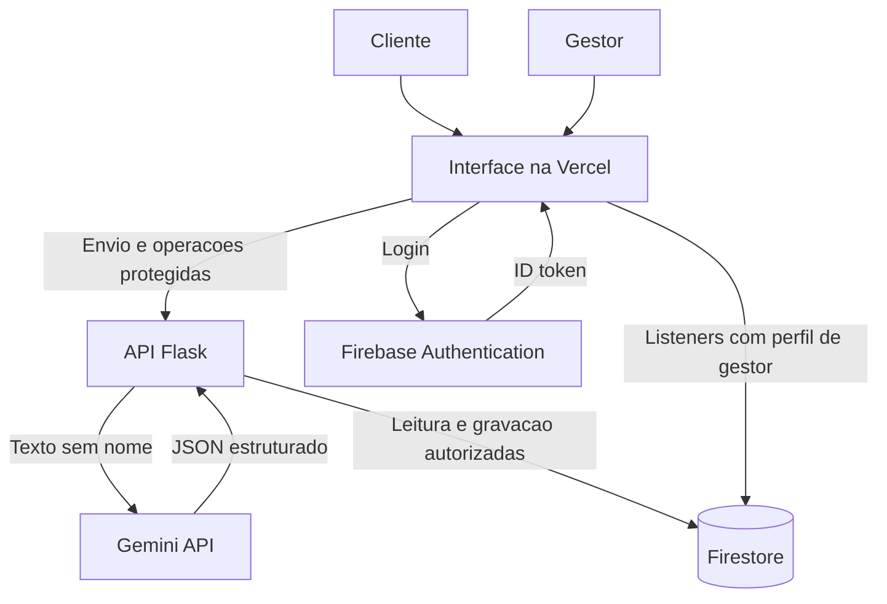
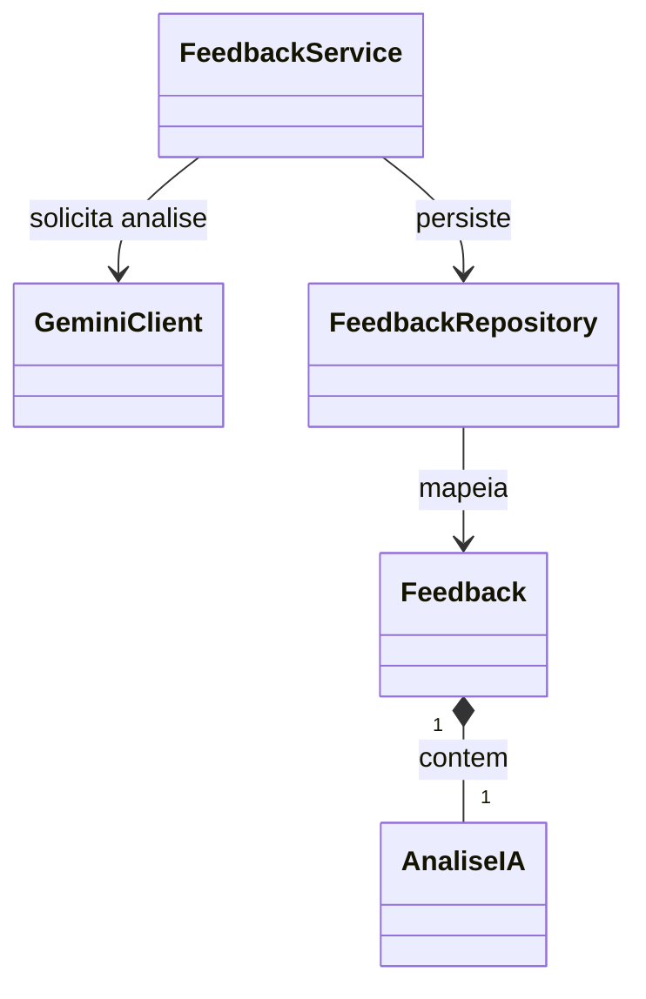
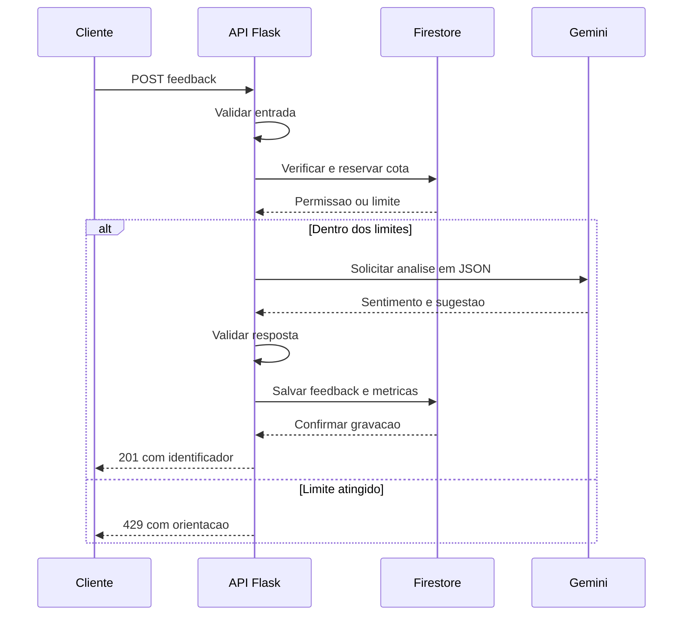
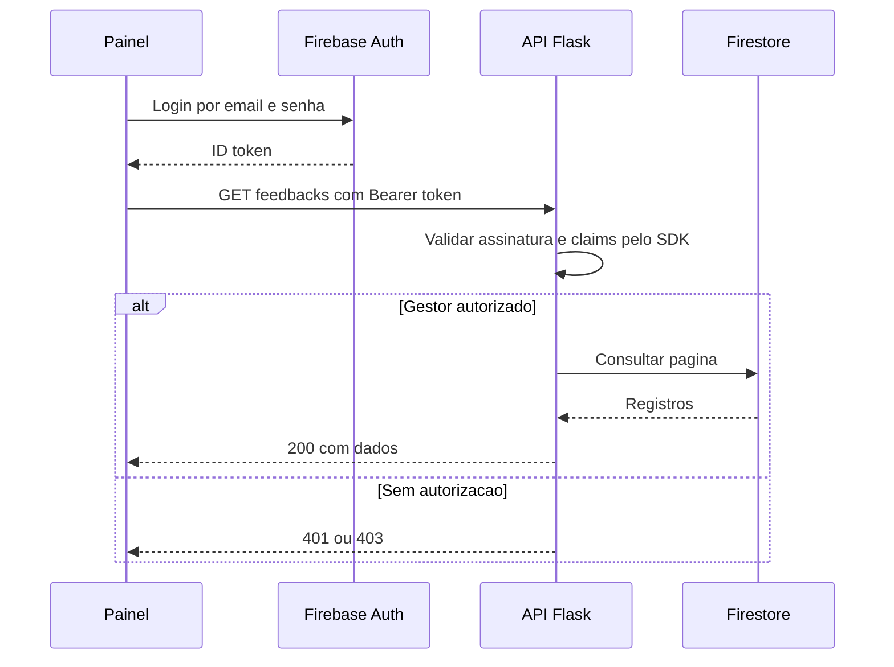

# VozDoCliente IA

Planejamento técnico e arquitetural do Projeto 4 — Análise de Feedbacks de Usuários com Integração de APIs de IA.

**Disciplina:** Computação em Nuvem — UNIFAN, 2026.2  
**Integrantes:** Rijkaard de Sousa, Diego Paim, Erik Nogueira, Rafael

Este documento descreve como desenvolveremos uma plataforma que recebe avaliações de clientes, classifica o sentimento com IA e sugere ações para o gestor. As funcionalidades, testes e configurações técnicas abaixo são planejados; sua conclusão dependerá da implementação e das evidências de execução.

As 11 seções seguem os temas do modelo de planejamento, adaptados às tecnologias sugeridas para o Projeto 4: Vercel Functions, Gemini API e Firestore. O backend será desenvolvido em Python com Flask. Esta arquitetura não utiliza a infraestrutura AWS e o banco relacional do exemplo: caso aquela stack seja exigida para todos os grupos, será necessária uma revisão arquitetural antes da implementação.

## 1. Visão Geral e Diferenciais do Projeto

### 1.1 Contexto e problema

O contexto proposto é o atendimento de pequenos estabelecimentos de comércio e serviços. Esses negócios recebem elogios, reclamações e sugestões, mas frequentemente precisam ler cada mensagem manualmente para identificar problemas recorrentes e decidir como agir.

O VozDoCliente IA será um sistema próprio de coleta e gestão dessas avaliações. A API de IA será integrada ao módulo de feedbacks. O primeiro protótipo atenderá um único estabelecimento, com dados fictícios para demonstração acadêmica.

### 1.2 Objetivo e diferencial

Receber um feedback por API HTTP, solicitar ao Gemini uma classificação `POSITIVO`, `NEGATIVO` ou `NEUTRO`, validar a resposta e armazenar o resultado no Firestore.

O diferencial será gerar também uma sugestão de plano de ação. Por exemplo, uma reclamação sobre demora poderá receber uma sugestão de revisar a distribuição de atendimentos. O gestor avaliará a sugestão antes de executá-la; a aplicação não realizará ações externas automaticamente.

### 1.3 Funcionalidades previstas

| Código | Funcionalidade | Critério de aceitação |
|---|---|---|
| RF01 | Receber nome opcional e feedback pelo formulário ou API | Rejeitar textos vazios e confirmar somente após persistência. |
| RF02 | Classificar o sentimento | Aceitar somente os três valores definidos. |
| RF03 | Gerar plano de ação | Armazenar sugestão textual validada e apresentá-la como sugestão de IA. |
| RF04 | Autenticar gestores | Restringir consultas e alterações a usuários autorizados. |
| RF05 | Exibir painel com atualizações em tempo real | Mostrar os 50 registros mais recentes e os totais por sentimento. |
| RF06 | Consultar registros anteriores | Oferecer paginação e consulta individual pela API. |
| RF07 | Acompanhar ações | Permitir alterar o status para PENDENTE, EM_ANALISE ou CONCLUIDO. |
| RF08 | Excluir feedback | Exigir gestor autenticado e confirmação na interface. |
| RF09 | Documentar e testar a API | Disponibilizar contrato OpenAPI e roteiro de teste no Postman. |

Integrações com WhatsApp, múltiplas empresas, envio de mensagens, cobrança e treinamento de modelo próprio ficam fora do protótipo inicial. RF01 a RF03 e a persistência formam o núcleo do Projeto 4; o painel e a gestão de ações complementam a proposta.

## 2. Jornadas de Usuário e Usabilidade

### 2.1 Envio pelo cliente

1. O cliente acessará o formulário e visualizará a finalidade da coleta.
2. Informará um nome opcional e um texto de 10 a 2.000 caracteres.
3. Ao enviar, o navegador validará os campos, desabilitará o botão e mostrará “Analisando feedback”.
4. A API validará novamente a entrada, verificará os limites de uso e solicitará a análise à IA.
5. Depois de validar o resultado e salvá-lo, a API retornará `201 Created` com o identificador e uma confirmação.
6. Somente então o formulário será limpo. Em erro, o texto permanecerá disponível e a interface explicará como tentar novamente.

O navegador usará uma chamada assíncrona para manter a interface responsiva. Entretanto, o processamento inicial ocorrerá dentro da mesma requisição HTTP: não haverá fila nem promessa de execução em background. Uma fila persistente será uma evolução possível se os testes indicarem essa necessidade.

### 2.2 Acesso do gestor

1. O gestor fará login por e-mail e senha no Firebase Authentication.
2. O sistema verificará o perfil autorizado, representado pela custom claim `gestor: true`.
3. O painel iniciará listeners dos feedbacks recentes e do documento de métricas.
4. O gestor poderá consultar o sentimento, ler a sugestão e atualizar o status da ação pela API protegida.
5. Registros antigos serão consultados por paginação, sem manter um listener de todo o histórico.
6. Ao sair ou fechar a tela, os listeners serão cancelados.

### 2.3 Acessibilidade e experiência de consumo

O formulário terá rótulos, navegação por teclado, foco visível e mensagens textuais. As classificações terão texto além de cores. Conteúdo do cliente e da IA será exibido como texto, sem interpretação de HTML.

A API usará JSON, rotas versionadas e erros com código estável, mensagem e `request_id`. O plano de ação ficará restrito ao gestor; o cliente receberá apenas a confirmação do envio.

## 3. System Design e Arquitetura Cloud

### 3.1 Stack e responsabilidades

| Camada | Tecnologia | Responsabilidade planejada |
|---|---|---|
| Interface | HTML, CSS e JavaScript | Formulário, login e painel. |
| Hospedagem | Vercel | Publicação da interface e domínio fornecido pela plataforma. |
| API | Python 3.12 e Flask em Vercel Functions | Validação, autorização, integração com IA e persistência. |
| IA | Google Gemini API | Classificação e sugestão em JSON estruturado. |
| Banco | Cloud Firestore Standard, plano Spark | Feedbacks, métricas e contadores de limite de uso. |
| Identidade | Firebase Authentication | Login dos gestores e emissão de ID tokens. |
| Integração contínua | GitHub Actions | Testes e publicação controlada. |

Python 3.12 é a versão proposta para padronizar desenvolvimento e execução. A Vercel suporta aplicações Flask pelo runtime Python; a configuração deverá seguir o preset e o ponto de entrada aceitos pelo serviço. Fontes: [runtime Python](https://vercel.com/docs/functions/runtimes/python) e [Flask](https://flask.palletsprojects.com/en/stable/).

### 3.2 Diagrama de componentes



### 3.3 Rede e comunicação

A aplicação usará endpoints gerenciados acessíveis por HTTPS. Navegador, API, Firebase e Gemini trocarão dados pela porta 443 em produção. Frontend e API deverão compartilhar a origem para simplificar a comunicação; qualquer origem adicional de desenvolvimento será listada explicitamente na configuração.

Não serão provisionados VPC, subnets, EC2, RDS, Internet Gateway, NAT Gateway, Security Groups ou Load Balancer próprios. Na stack escolhida, a plataforma administra a execução e o encaminhamento das requisições. As regras de acesso da aplicação serão implementadas por autorização da API, Firebase Security Rules e IAM.

O domínio inicial será o endereço disponibilizado pela Vercel. Não há contratação de domínio próprio ou Route 53 no orçamento.

### 3.4 Consistência e disponibilidade

Após a análise, uma operação atômica criará o feedback e incrementará os totais em `metricas/geral`. A exclusão também atualizará os contadores de forma atômica. Assim, não haverá confirmação de sucesso com registro salvo e métricas ausentes.

A chamada à IA ocorrerá fora de transações do banco para evitar repetições causadas por reexecução de transações. A API não manterá dados essenciais apenas em memória ou em arquivos locais de uma função.

Se a IA falhar, o sistema não inventará uma classificação. Se o banco falhar, não retornará confirmação de armazenamento. O protótipo não promete disponibilidade contínua nem latência garantida.

Fonte: [transações e gravações em lote no Firestore](https://firebase.google.com/docs/firestore/manage-data/transactions).

## 4. Segurança e Gestão de Acessos

### 4.1 Autenticação e autorização

O envio de feedback será público e sujeito a validação e limites. Leituras, métricas, alterações de status e exclusões pela API exigirão `Authorization: Bearer <ID_TOKEN>`.

O backend verificará o ID token com o Firebase Admin SDK e exigirá a claim `gestor: true`. Tokens inválidos ou expirados resultarão em `401`; um usuário autenticado sem o perfil exigido receberá `403`. A renovação será gerenciada pelo SDK cliente; o backend não aceitará um token apenas por conseguir decodificá-lo.

A criação dos gestores e a atribuição de claims serão administrativas. Não haverá endpoint público para conceder permissões. Fontes: [verificação de ID tokens](https://firebase.google.com/docs/auth/admin/verify-id-tokens) e [custom claims](https://firebase.google.com/docs/auth/admin/custom-claims).

### 4.2 Regras de acesso do navegador ao banco

Política planejada para os listeners do painel:

```javascript
rules_version = '2';
service cloud.firestore {
  match /databases/{database}/documents {
    function isGestor() {
      return request.auth != null && request.auth.token.gestor == true;
    }
    match /feedbacks/{id} {
      allow read: if isGestor();
      allow write: if false;
    }
    match /metricas/{id} {
      allow read: if isGestor();
      allow write: if false;
    }
    match /{document=**} {
      allow read, write: if false;
    }
  }
}
```

As regras serão testadas antes da publicação. Bibliotecas de servidor usam credenciais e IAM, ignorando essas Security Rules. Por isso, o bloqueio de gravação no navegador não substitui a validação do backend. Fonte: [condições das Security Rules](https://firebase.google.com/docs/firestore/security/rules-conditions).

### 4.3 Permissões administrativas e secrets

| Identidade | Acesso planejado |
|---|---|
| Cliente público | Enviar feedback; sem leitura do banco. |
| Gestor autorizado | Consultar dados e alterar ações pela API. |
| Conta de serviço do backend | Acesso aos dados do Firestore no projeto dedicado; sem papel Owner ou Editor. |
| Administrador de usuários | Criar gestores e atribuir claims; credencial separada do runtime. |
| Pipeline | Publicar no projeto Vercel; sem chaves de IA para testes comuns. |

A permissão de dados será limitada ao projeto de demonstração, usando como referência o papel `roles/datastore.user`. Esse papel não restringe o backend a uma única coleção; o isolamento do projeto e a validação por rota continuam necessários. Fontes: [IAM para bibliotecas de servidor do Firestore](https://docs.cloud.google.com/firestore/native/docs/security/iam) e [papéis IAM dos produtos Firebase](https://firebase.google.com/docs/projects/iam/roles-predefined-product).

`GEMINI_API_KEY` e credenciais administrativas ficarão em variáveis protegidas da Vercel. No desenvolvimento, serão carregadas por arquivo local ignorado pelo Git. O repositório conterá apenas `.env.example`, sem valores secretos. Credenciais de deploy ficarão no GitHub Secrets. Uma credencial exposta deverá ser revogada e substituída.

### 4.4 Proteção de entrada e dos dados

O backend limitará o tamanho do corpo, validará tipos, recusará campos não previstos e aplicará rate limit compartilhado entre instâncias. CORS não será considerado autenticação. A entrada do cliente será tratada como dado a analisar, nunca como instrução para executar comandos ou alterar o comportamento do sistema.

No protótipo acadêmico serão usados feedbacks fictícios. O nome opcional não será enviado ao Gemini. Logs não conterão tokens, chaves, nomes ou texto integral dos feedbacks. Não serão enviados documentos pessoais ou informações sensíveis à IA.

A documentação de preços do Gemini informa uso de dados para melhoria de produtos no tier gratuito; o grupo deverá considerar essa condição antes de qualquer uso com dados reais. Fonte: [preços e condições do Gemini](https://ai.google.dev/gemini-api/docs/pricing).

O tráfego será protegido por HTTPS. A persistência usará os mecanismos gerenciados de proteção do provedor, sem criptografia própria desenvolvida pelo grupo. Uma política institucional de dados reais ficará fora desta demonstração.

## 5. Plano de Escalonamento

### 5.1 Estratégia inicial

A capacidade de execução das funções será administrada pela Vercel. A aplicação será sem estado local: os registros, métricas e controles compartilhados ficarão no Firestore. Não serão configurados gatilhos próprios de EC2 por CPU ou memória, nem será prometido escalonamento ilimitado.

O principal gargalo esperado é a cota da API de IA. Aumentar a concorrência das funções não aumenta essa cota. Os limites de uso do Gemini dependem do modelo e da conta e deverão ser consultados no AI Studio. Fonte: [limites da Gemini API](https://ai.google.dev/gemini-api/docs/rate-limits).

### 5.2 Parâmetros propostos para o piloto

| Parâmetro | Valor inicial proposto | Comportamento |
|---|---|---|
| Envio por origem | 2 tentativas por minuto por identificador de origem | Retornar `429` ao exceder. |
| Chamadas globais de IA | Até 5 por minuto | Reduzir se a cota efetiva for menor. |
| Chamadas globais por dia | Até 100 | Reservar margem para testes e tentativas com falha. |
| Tamanho do feedback | 10 a 2.000 caracteres | Recusar fora da faixa. |
| Tempo de espera da IA | 20 segundos | Interromper e devolver erro controlado. |
| Duração alvo da função | Até 30 segundos | Validar suporte/configuração e reservar tempo para persistência. |
| Listener do painel | Últimos 50 feedbacks | Paginar o histórico restante. |

Esses números são decisões do projeto, não limites garantidos pelos provedores. Antes do deploy, o limite efetivo será o menor entre a meta interna e a cota disponível, incluindo tokens por minuto.

O limitador usará transações em documentos compartilhados no Firestore, com contadores por janela de tempo e por origem. O identificador de origem será derivado por HMAC do IP informado pela plataforma, com segredo do backend; cabeçalhos arbitrários do cliente não serão confiados. IP compartilhado pode limitar vários usuários, portanto esse controle é adequado apenas ao piloto.

Os contadores serão verificados e reservados antes da chamada à IA. Falhas também consumirão a reserva para evitar repetição excessiva. Não haverá retry automático no MVP. Os documentos antigos do limitador serão removidos por manutenção manual; não será habilitado TTL pago.

### 5.3 Monitoramento e crescimento

Serão acompanhados quantidade de requisições, proporção de `429` e `5xx`, duração p95, chamadas ao Gemini e leituras/gravações do Firestore. Atingir 80% de uma cota será um gatilho operacional para reduzir ou suspender novos envios, não um gatilho de autoscaling por CPU.

Caso surjam picos frequentes, a evolução proposta será introduzir fila persistente e consumidor, devolver `202 Accepted` com identificador de acompanhamento e implementar idempotência e retentativas controladas. Essa evolução exigirá nova estimativa de custo.

## 6. Estrutura de Banco de Dados

### 6.1 Modelo escolhido

Será usado Firestore NoSQL. Não haverá tabelas relacionais, chaves estrangeiras ou ORM SQLAlchemy nesta versão. O mapeamento será feito entre objetos Python e documentos, encapsulado em um repositório de dados. A escolha segue a alternativa de banco apresentada para o Projeto 4.

Cada documento de feedback conterá exatamente uma análise de IA embutida, representando uma associação lógica 1:1. Haverá vários gestores autorizados para o mesmo estabelecimento, com identidades mantidas no Firebase Authentication. Não serão modeladas relações N:N no MVP.

### 6.2 Dicionário de dados de feedbacks

Coleção: `feedbacks`. O identificador será gerado pelo backend/SDK e exposto como `id` nas respostas.

| Campo | Tipo no Firestore | Regra |
|---|---|---|
| `cliente_nome` | String ou null | Opcional, até 80 caracteres; não enviado à IA. |
| `texto_original` | String | Obrigatório, de 10 a 2.000 caracteres. |
| `sentimento_ia` | String | POSITIVO, NEGATIVO ou NEUTRO. |
| `plano_acao_ia` | String | Obrigatório, de 1 a 1.000 caracteres. |
| `status_acao` | String | PENDENTE, EM_ANALISE ou CONCLUIDO; padrão PENDENTE. |
| `modelo_ia` | String | Identificador efetivamente usado. |
| `versao_prompt` | String | Versão do prompt, inicialmente v1. |
| `criado_em` | Timestamp | Preenchido pelo servidor. |
| `atualizado_em` | Timestamp | Preenchido pelo servidor. |
| `atualizado_por` | String ou null | UID do gestor que alterou o status. |

As restrições serão aplicadas no backend. O Firestore não imporá essas regras como constraints SQL para gravações feitas pelo Admin SDK. Timestamps serão convertidos para ISO 8601 em UTC na API.

### 6.3 Documentos auxiliares

| Caminho | Campos | Finalidade |
|---|---|---|
| `metricas/geral` | `total`, `positivo`, `negativo`, `neutro`: inteiros; `atualizado_em`: Timestamp | Totais dos registros existentes, atualizados junto com inclusão/exclusão. |
| `rate_limits/{chave}` | `contagem`: inteiro; `janela_inicio`, `expira_em`: Timestamp | Contadores por minuto/dia e por origem; acesso exclusivo do backend. |

Os campos `expira_em` orientarão a limpeza manual, sem ativar TTL. As leituras do painel serão limitadas e ordenadas por `criado_em`. Índices adicionais só serão criados quando as consultas implementadas exigirem, com configuração versionada.

### 6.4 Persistência e recuperação

`FeedbackRepository` converterá entidades em dicionários, criará documentos, consultará páginas e realizará atualizações atômicas com as métricas. Os textos extensos não serão usados como índices de busca.

Para a demonstração, será mantido um conjunto fictício reproduzível e um procedimento de reconstrução do banco. Backups gerenciados e recuperação pontual não fazem parte do custo zero: a documentação os lista entre os recursos que exigem faturamento. Fonte: [cotas e recursos do Firestore](https://firebase.google.com/docs/firestore/quotas).

## 7. Design de Software e UML

### 7.1 Responsabilidades das classes

| Classe | Atributos principais | Métodos planejados |
|---|---|---|
| `Feedback` | `id: str`, `texto: str`, `nome: str ou None`, `status: str` | `validar()`, `to_dict()` |
| `AnaliseIA` | `sentimento: str`, `plano_acao: str`, `modelo: str` | `validar()`, `to_dict()` |
| `FeedbackService` | `ia_client`, `repository`, `rate_limiter` | `receber()`, `consultar()`, `alterar_status()`, `excluir()` |
| `GeminiClient` | `api_key: str`, `model: str`, `timeout: int` | `analisar(texto)` |
| `FeedbackRepository` | `db` | `criar_com_metricas()`, `buscar()`, `listar()`, `excluir_com_metricas()` |
| `AuthService` | `firebase_app` | `verificar_token()`, `exigir_gestor()` |
| `RateLimiter` | `db`, `limites` | `verificar_e_reservar()` |

As rotas Flask atuarão como controllers: interpretarão HTTP, chamarão os serviços e formatarão respostas. Regras de negócio e chamadas externas não ficarão concentradas nas rotas.



### 7.2 Sequência de envio



Falhas de IA ou persistência interromperão o caminho de sucesso e seguirão os códigos de erro da seção 8.

### 7.3 Sequência de login e consulta protegida



A consulta histórica passará pela API. Os listeners dos registros recentes acessarão o Firestore diretamente e serão autorizados pelas Security Rules. Fonte: [atualizações em tempo real](https://firebase.google.com/docs/firestore/query-data/listen).

## 8. Design e Documentação da API REST

### 8.1 Rotas planejadas

Base: `/api/v1`. A URL de produção será registrada após o deploy.

| Método | Rota | Acesso | Resultado |
|---|---|---|---|
| GET | `/api/v1/health` | Público | `200` com versão e estado da aplicação, sem secrets. |
| POST | `/api/v1/feedbacks` | Público, limitado | `201` após análise e armazenamento. |
| GET | `/api/v1/feedbacks` | Gestor | `200` com página e próximo cursor. |
| GET | `/api/v1/feedbacks/{id}` | Gestor | `200` com um feedback ou `404`. |
| PATCH | `/api/v1/feedbacks/{id}/status` | Gestor | `200` com status atualizado. |
| DELETE | `/api/v1/feedbacks/{id}` | Gestor | `204` após exclusão e atualização das métricas. |
| GET | `/api/v1/dashboard/metricas` | Gestor | `200` com totais. |
| GET | `/openapi.json` | Público | Contrato, sem dados reais ou credenciais. |
| GET | `/docs` | Público | Interface Swagger UI. |

Não haverá `PUT`: a substituição integral de feedback não faz parte do escopo. Login e renovação serão realizados pelo Firebase Authentication.

### 8.2 Contratos principais

Exemplo de entrada:

```json
{
  "nome": "Cliente de teste",
  "texto": "O atendimento foi cordial, mas esperei muito para ser atendido."
}
```

O backend aceitará `nome` opcional e `texto` obrigatório. Recusará campos extras, tipos incorretos, texto em branco e corpo acima de 16 KiB. Dados fora das regras retornarão `422`; JSON inválido, `400`; conteúdo que não seja JSON, `415`.

Contrato da análise produzida pela IA, ilustrativo:

```json
{
  "sentimento": "NEGATIVO",
  "plano_acao": "Revisar a distribuicao dos atendimentos nos horarios de maior movimento."
}
```

Será utilizado schema JSON com enum de sentimentos, campos obrigatórios e rejeição de propriedades extras. O backend validará também os comprimentos e os valores retornados. A saída da IA não será executada como código nem tratada como fato verificado. Fonte: [saídas estruturadas do Gemini](https://ai.google.dev/gemini-api/docs/structured-output).

Resposta pública de sucesso:

```json
{
  "data": {
    "id": "identificador-gerado",
    "mensagem": "Feedback recebido e registrado."
  },
  "request_id": "identificador-da-requisicao"
}
```

Atualização de status:

```json
{
  "status_acao": "EM_ANALISE"
}
```

A listagem aceitará `limit` entre 1 e 50 e um cursor opaco validado pelo backend. A ordenação usará data e identificador como desempate. O painel distinguirá os totais de toda a base dos registros exibidos na página.

### 8.3 Erros e resiliência

```json
{
  "error": {
    "code": "FEEDBACK_INVALIDO",
    "message": "O texto deve ter entre 10 e 2000 caracteres."
  },
  "request_id": "identificador-da-requisicao"
}
```

| HTTP | Condição |
|---|---|
| 400 | JSON malformado ou cursor inválido. |
| 401 | Token ausente, inválido ou expirado em rota protegida. |
| 403 | Usuário sem perfil de gestor. |
| 404 | Feedback inexistente. |
| 413 | Corpo acima do limite. |
| 415 | Tipo de conteúdo incorreto. |
| 422 | Campos inválidos ou texto sem conteúdo analisável por bloqueio do provedor. |
| 429 | Limite interno atingido; informar `Retry-After` quando calculável. |
| 502 | Resposta da IA inválida ou incompleta. |
| 503 | Banco indisponível ou cota/serviço externo temporariamente indisponível. |
| 504 | Tempo de espera da análise excedido. |

O formulário impedirá cliques repetidos enquanto aguarda. O MVP não terá garantia de processamento exatamente uma vez: uma falha de conexão após a gravação pode levar a duplicação se o usuário reenviar. Idempotência persistente será uma melhoria posterior, caso esse cenário apareça nos testes.

### 8.4 OpenAPI e roteiro de demonstração

O contrato `docs/openapi.yaml` documentará os schemas, limites, respostas, paginação e esquema `bearerAuth`. A aplicação servirá a representação JSON e a interface Swagger UI. Fonte: [especificação OpenAPI](https://swagger.io/specification/).

No Postman, o grupo deverá demonstrar: health check; envio válido; registro salvo com sentimento e ação; consulta autenticada; rejeição de leitura sem autorização; validação de entrada; alteração de status; exclusão; comportamento de limite e falha da IA. Resultados simulados serão identificados como simulados.

## 9. Estratégia de Testes

### 9.1 Testes unitários

Usaremos pytest para testar validação de entrada, enum de sentimentos, schema da resposta da IA, regras de status, autorização e tradução de erros. O Gemini e o repositório serão substituídos por mocks nesses testes, evitando chamadas externas e consumo de cotas.

### 9.2 Testes de integração

O cliente de testes do Flask será integrado aos emuladores de Firestore e Authentication. Serão verificados persistência, paginação, atualização atômica das métricas e comportamento do rate limit com requisições concorrentes.

As Security Rules terão testes próprios pelo SDK cliente/emulador: visitante sem acesso, usuário comum sem acesso, gestor com leitura e gravação direta negada. Um teste feito somente com Admin SDK não demonstra que as regras do navegador funcionam.

### 9.3 Testes de ponta a ponta

| Cenário | Resultado esperado |
|---|---|
| Enviar feedback válido | Confirmar somente após persistência e atualizar painel. |
| IA retornar JSON inválido | Exibir erro e não criar análise inconsistente. |
| IA exceder timeout | Preservar texto no formulário e retornar erro controlado. |
| Banco falhar | Não anunciar sucesso. |
| Usuário comum abrir painel | Negar leitura de dados. |
| Gestor alterar status | Persistir valor, data e UID do responsável. |
| Excluir feedback | Remover registro e corrigir contadores. |
| Enviar requisições acima da cota | Recusar excedentes sem novas chamadas à IA. |

A demonstração real com Gemini será pequena e manual, separada da suíte automática. O modelo é probabilístico; os testes unitários validarão o contrato, enquanto a qualidade da classificação será avaliada com exemplos previamente revisados pelo grupo.

### 9.4 Evidências e critérios de conclusão

Guardaremos relatório de testes, captura da execução do pipeline, exemplos do Postman, evidência do Firestore e painéis de consumo sem dados secretos. Testes de carga usarão IA simulada, inicialmente com 1, 5 e 10 clientes simultâneos; os valores medidos serão registrados, sem apresentar metas como resultados já atingidos.

Fontes: [pytest](https://docs.pytest.org/en/stable/) e [Firebase Emulator Suite](https://firebase.google.com/docs/emulator-suite).

## 10. DevOps, CI/CD e Infraestrutura como Código

### 10.1 Organização prevista do repositório

Os arquivos abaixo compõem o plano de implementação; sua listagem não indica que já foram criados.

| Caminho | Finalidade |
|---|---|
| `app.py` | Ponto de entrada Flask. |
| `src/routes/` | Controllers e rotas HTTP. |
| `src/services/` | Regras de negócio, autenticação e rate limit. |
| `src/repositories/` | Persistência no Firestore. |
| `src/integrations/` | Cliente Gemini. |
| `src/models/` | Entidades e validações. |
| `templates/` e `static/` | Interface, estilos e scripts. |
| `tests/unit/`, `tests/integration/` | Testes automatizados. |
| `docs/openapi.yaml` | Contrato da API. |
| `docs/evidencias/` | Registros dos testes e da demonstração. |
| `firestore.rules`, `firestore.indexes.json`, `firebase.json` | Regras, índices e configuração dos emuladores/deploy. |
| `requirements.txt`, `requirements-dev.txt` | Dependências com versões fixadas após validação. |
| `.env.example`, `.gitignore` | Configuração de exemplo e exclusões de arquivos locais. |
| `.github/workflows/ci.yml` | Verificação de alterações. |
| `.github/workflows/deploy.yml` | Publicação após testes. |
| `README.md` | Planejamento e instruções atualizadas. |

### 10.2 Configuração por ambiente

| Variável | Uso | Sigilosa |
|---|---|---|
| `GEMINI_API_KEY` | Acesso do backend à IA. | Sim |
| `GEMINI_MODEL` | Modelo selecionado; candidato inicial `gemini-2.5-flash`. | Não |
| `FIREBASE_PROJECT_ID` | Projeto de banco e identidade. | Não |
| `FIREBASE_SERVICE_ACCOUNT_JSON` | Credencial do backend, carregada em memória. | Sim |
| `RATE_LIMIT_HMAC_SECRET` | Derivação do identificador de origem. | Sim |
| `ALLOWED_ORIGIN` | Origem autorizada quando necessário. | Não |
| `AI_REQUESTS_PER_MINUTE` | Limite interno conforme cota real. | Não |
| `AI_REQUESTS_PER_DAY` | Teto diário do piloto. | Não |
| `AI_TIMEOUT_SECONDS` | Tempo máximo de análise. | Não |
| `APP_ENV` | Identificação do ambiente. | Não |

As configurações públicas do SDK Firebase serão separadas das credenciais administrativas. Produção nunca receberá variáveis que direcionem o SDK para emuladores. Preview e testes não usarão dados de produção.

### 10.3 Pipeline planejado

1. Pull requests executarão validações, testes unitários e testes com emuladores, sem secrets de produção.
2. Após revisão e integração na `main`, o workflow de deploy repetirá os testes no commit exato a publicar.
3. Se houver falha, a publicação será interrompida.
4. Com os testes aprovados, o pipeline publicará na Vercel usando credenciais protegidas.
5. Um smoke test consultará `/api/v1/health` e verificará a resposta esperada.
6. Se necessário, será restaurado o último deployment validado; alterações incompatíveis de dados deverão ter plano próprio de reversão.

A publicação de produção será controlada por esse fluxo. A integração Git nativa da Vercel deverá ser configurada para não publicar em paralelo antes dos testes. Permissões padrão do workflow serão mínimas, como `contents: read`, com secrets apenas no job de deploy.

Fontes: [GitHub Actions com Vercel](https://vercel.com/kb/guide/how-can-i-use-github-actions-with-vercel) e [GitHub Secrets](https://docs.github.com/en/actions/how-tos/write-workflows/choose-what-workflows-do/use-secrets).

### 10.4 Provisionamento, Docker e Terraform

Na primeira versão, os projetos Vercel e Firebase serão configurados pelos consoles/CLIs e documentados. Regras, índices, dependências e workflows serão versionados. Isso oferece configuração reproduzível parcial; não constitui provisionamento integral por Terraform.

Docker poderá ser usado para padronizar o ambiente local e os testes, com dependências de desenvolvimento separadas e credenciais injetadas em runtime. Ele não será requisito do deploy serverless escolhido. Não haverá imagem publicada no ECR nem recursos AWS provisionados apenas para reproduzir o exemplo.

Terraform fica como evolução de automação, mediante escolha e validação dos providers e dos recursos necessários. Seu estado deverá ficar protegido e separado do repositório. Se Docker, ECR e Terraform forem exigências universais da disciplina, o escopo terá de ser ajustado com o professor antes da execução.

Referências para essa evolução: [Docker Build](https://docs.docker.com/build/) e [Terraform](https://developer.hashicorp.com/terraform/docs).

### 10.5 Passo a passo planejado de implementação e deploy

1. Criar a estrutura de aplicação e dependências, implementar as rotas e o cliente Gemini.
2. Configurar emuladores e executar os testes locais com IA simulada.
3. Criar um projeto Firebase dedicado, banco Firestore Standard no Spark e login por e-mail/senha.
4. Escolher a localização do banco e registrar a decisão; preferir proximidade da região da API, verificando disponibilidade e transferência entre serviços.
5. Publicar as regras e índices testados; criar o gestor e atribuir a claim por procedimento administrativo separado.
6. Configurar credencial de backend com acesso limitado ao projeto.
7. Criar/configurar a chave Gemini, validar o modelo disponível e registrar as cotas efetivas no AI Studio.
8. Configurar Vercel para Flask, variáveis por ambiente e duração de função compatível com o orçamento de tempo.
9. Configurar GitHub Secrets e o pipeline, evitando deploy duplicado.
10. Publicar, executar a demonstração real no Postman e revisar logs e consumo.
11. Registrar URL, commit, configurações efetivas, resultados e evidências no repositório.

## 11. Detalhamento de Custos

### 11.1 Premissas de uso

O objetivo é manter o protótipo acadêmico dentro das cotas gratuitas. A estimativa não é garantia de gratuidade nem comprovação de consumo real. Consideramos um mês de 30 dias, até 100 análises por dia e até cinco gestores de teste. Se a conta Gemini não suportar esse volume gratuito, reduziremos os envios.

| Item | Premissa de dimensionamento |
|---|---|
| Análises | Até 3.000/mês, sem retry automático. |
| Requisições totais à API | Até 10.000/mês, incluindo consultas e testes. |
| Uso de CPU | Hipótese de 0,2 segundo ativo por requisição: cerca de 0,56 hora/mês. |
| Memória provisionada | Hipótese conservadora de 1 GiB por 10 segundos em 10.000 requisições: cerca de 27,8 GiB-h/mês. |
| Leituras no Firestore | Orçamento inicial de 5.000/dia, incluindo listeners, consultas e limitador. |
| Gravações no Firestore | Orçamento inicial de 1.000/dia, incluindo métricas e limitador. |
| Exclusões | Até 1.000/dia em manutenção e testes. |
| Armazenamento | Reserva inicial de 100 MiB para dados, índices e documentos auxiliares. |
| Transferência do Firestore | Meta de até 1 GiB/mês. |

As hipóteses de CPU e memória precisam ser substituídas por medições. Contadores, reconexões de listeners, testes e tentativas com falha também consomem recursos. O rate limit não elimina o custo de receber tráfego abusivo.

### 11.2 Estimativa mensal por serviço

| Serviço | Condição considerada | Estimativa em USD |
|---|---|---|
| Vercel Hosting e Functions | Hobby, uso acadêmico elegível e consumo dentro de todas as franquias. | US$ 0,00 |
| Firestore Standard | Spark e consumo abaixo das cotas gratuitas. | US$ 0,00 |
| Firebase Authentication | Pequeno grupo de teste com e-mail/senha, sem SMS ou recursos pagos. | US$ 0,00 |
| Gemini API | Modelo com tier gratuito disponível e volume dentro da cota efetiva da conta. | US$ 0,00 |
| GitHub e Actions | Execuções dentro da franquia aplicável ao repositório/conta. | US$ 0,00 |
| Domínio próprio e infraestrutura AWS | Não contratados nesta arquitetura. | US$ 0,00 |
| **Total estimado do cenário gratuito** | **Condicionado às premissas e à elegibilidade dos planos.** | **US$ 0,00** |

A documentação consultada da Vercel apresenta, no Hobby com Fluid Compute, 1 milhão de invocações/mês, 4 horas de CPU ativa e 360 GB-h de memória provisionada. Devem ser conferidos também transferência, builds e demais limites do plano. Fonte: [preços de Functions](https://vercel.com/docs/functions/usage-and-pricing).

O uso previsto é uma demonstração acadêmica sem operação comercial; uma implantação comercial exigirá reavaliação das condições do [plano Hobby](https://vercel.com/docs/plans/hobby). As demais condições deverão ser verificadas nas páginas de [preços do Firebase](https://firebase.google.com/pricing) e [faturamento do GitHub Actions](https://docs.github.com/en/billing/concepts/product-billing/github-actions).

O Firestore informa franquias de 1 GiB armazenado, 50 mil leituras/dia, 20 mil gravações/dia, 20 mil exclusões/dia e 10 GiB de transferência de saída/mês. Há uma base gratuita por projeto. Fonte: [cotas do Firestore](https://firebase.google.com/docs/firestore/quotas).

O modelo candidato `gemini-2.5-flash` aparece com entrada e saída gratuitas no tier Standard gratuito na referência consultada. Sua disponibilidade e seus limites deverão ser confirmados na conta antes da implementação; o identificador ficará em variável de ambiente. Fontes: [preços do Gemini](https://ai.google.dev/gemini-api/docs/pricing) e [limites por conta](https://ai.google.dev/gemini-api/docs/rate-limits).

### 11.3 Controle de consumo e evidências

Não serão habilitados automaticamente planos pagos, backups gerenciados, TTL ou serviços extras. A equipe verificará os painéis antes e depois das demonstrações, registrando data, volume de operações e custo observado. Ao se aproximar das cotas, reduzirá os limites ou suspenderá envios; aumentar um plano exigirá revisão do orçamento.

O relatório final deverá incluir capturas dos painéis Vercel, Firebase e AI Studio, além de distinguir esta estimativa do custo efetivamente observado.

A [AWS Pricing Calculator](https://calculator.aws/) mencionada no quadro será uma referência caso a arquitetura migre para AWS. Ela não calcula os custos desta combinação Vercel/Firebase/Gemini. Nesta versão, a estimativa se apoia nas referências oficiais dos serviços utilizados.

### 11.4 Índice de documentação oficial

| Assunto | Documentação | Aplicação no projeto |
|---|---|---|
| Python serverless | [Vercel Python Runtime](https://vercel.com/docs/functions/runtimes/python) | Entrada Flask e runtime. |
| API Python | [Flask](https://flask.palletsprojects.com/en/stable/) | Rotas, validação e aplicação. |
| Preços de funções | [Vercel Functions Pricing](https://vercel.com/docs/functions/usage-and-pricing) | CPU, memória e invocações. |
| Plano de hospedagem | [Vercel Hobby](https://vercel.com/docs/plans/hobby) | Elegibilidade e limites do plano. |
| Planos Firebase | [Firebase Pricing](https://firebase.google.com/pricing) | Spark e autenticação. |
| Custos do pipeline | [GitHub Actions Billing](https://docs.github.com/en/billing/concepts/product-billing/github-actions) | Franquias de execução. |
| Deploy | [GitHub Actions com Vercel](https://vercel.com/kb/guide/how-can-i-use-github-actions-with-vercel) | Publicação controlada. |
| Secrets | [GitHub Secrets](https://docs.github.com/en/actions/how-tos/write-workflows/choose-what-workflows-do/use-secrets) | Credenciais do pipeline. |
| Identidade | [Verificação de ID tokens](https://firebase.google.com/docs/auth/admin/verify-id-tokens) | Autenticação do backend. |
| Perfis | [Custom claims](https://firebase.google.com/docs/auth/admin/custom-claims) | Autorização de gestores. |
| Banco seguro | [Security Rules](https://firebase.google.com/docs/firestore/security/rules-conditions) | Restrições do SDK cliente. |
| IAM | [Papéis de produtos Firebase](https://firebase.google.com/docs/projects/iam/roles-predefined-product) | Permissões administrativas. |
| IAM do backend | [Segurança das bibliotecas de servidor](https://docs.cloud.google.com/firestore/native/docs/security/iam) | Acesso do Admin SDK. |
| Atualizações | [Listeners do Firestore](https://firebase.google.com/docs/firestore/query-data/listen) | Painel em tempo real. |
| Consistência | [Transações e lotes](https://firebase.google.com/docs/firestore/manage-data/transactions) | Feedbacks e métricas. |
| Banco e custos | [Cotas do Firestore](https://firebase.google.com/docs/firestore/quotas) | Dimensionamento. |
| IA estruturada | [Structured outputs](https://ai.google.dev/gemini-api/docs/structured-output) | Contrato da resposta. |
| IA e preço | [Gemini API Pricing](https://ai.google.dev/gemini-api/docs/pricing) | Modelo e tier gratuito. |
| IA e capacidade | [Gemini Rate Limits](https://ai.google.dev/gemini-api/docs/rate-limits) | Limites efetivos da conta. |
| Testes Python | [pytest](https://docs.pytest.org/en/stable/) | Testes unitários e integração. |
| Testes Firebase | [Emulator Suite](https://firebase.google.com/docs/emulator-suite) | Testes locais isolados. |
| Contrato HTTP | [OpenAPI](https://swagger.io/specification/) | Documentação da API. |
| Containers | [Docker Build](https://docs.docker.com/build/) | Evolução do ambiente local. |
| IaC | [Terraform](https://developer.hashicorp.com/terraform/docs) | Evolução de provisionamento. |
| Alternativa AWS | [AWS Pricing Calculator](https://calculator.aws/) | Estimativa se houver migração de arquitetura. |

Referências consultadas em 17/09/2026. Planos, modelos e limites deverão ser conferidos novamente no momento do deploy.# Projeto TDE: VozDoCliente IA (Análise de Feedbacks)
| **Google Gemini API** | Processamento NLP | Free Tier | $0.00 |
| **Total Estimado** | Ambiente otimizado para TDE | - | **$0.00** |
