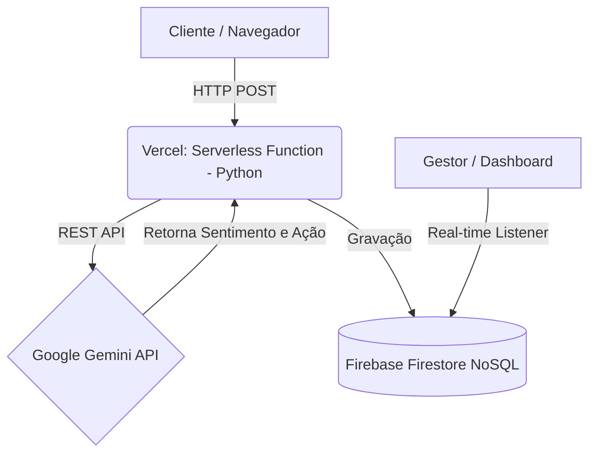
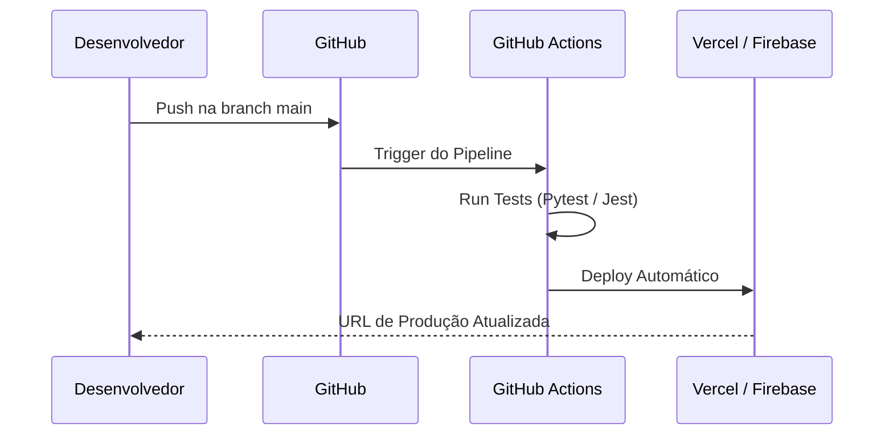

# Projeto TDE: VozDoCliente IA (Análise de Feedbacks)

**Alunos:** Rijkaard Sousa, Diego Paim, Erik Nogueira, Rafael
**Disciplina:** Computação em Nuvem (Unifan 2026.2)

---

## 1. Visão Geral e Diferenciais do Projeto
O **VozDoCliente IA** é uma plataforma baseada em nuvem para capturar, processar e analisar feedbacks de usuários em tempo real. Utilizando arquitetura Serverless e APIs de Inteligência Artificial, o sistema classifica automaticamente a percepção do cliente (Positivo, Negativo ou Neutro).

**O Grande Diferencial:** Além da análise de sentimento padrão, o nosso sistema integra a API do Google Gemini para gerar automaticamente uma **"Sugestão de Plano de Ação"** direcionada ao gestor, transformando reclamações ou elogios em tarefas acionáveis e estratégicas de forma imediata.

## 2. Jornadas de Usuário e Usabilidade

**Jornada do Usuário Final (Cliente):**
1. **Envio:** O cliente acessa a interface web estática (HTML/JS) e envia seu feedback. O formulário é limpo imediatamente, sem travamentos (processamento assíncrono).
2. **Processamento (Backend):** O frontend dispara uma requisição `POST` para a nossa API Serverless.
3. **Análise (IA):** A API Serverless empacota o texto e aciona a `Google Gemini API`, solicitando o sentimento e o plano de ação.
4. **Armazenamento:** A resposta estruturada é salva no banco de dados NoSQL (`Firebase Firestore`).
5. **Consumo (Gestor):** O gestor acessa um Dashboard que escuta o Firestore em tempo real, visualizando os novos feedbacks instantaneamente.

**Usabilidade e Developer Experience (DX):**
* Retornos e *status codes* HTTP padronizados (ex: `200 OK`, `401 Unauthorized`).
* Rotas bem definidas (`/api/v1/feedbacks`).

## 3. System Design e Arquitetura Cloud (AWS / GCP)

Optamos por uma arquitetura focada em **Custo Zero**, utilizando o ecossistema Firebase (GCP) e Vercel.

**Arquitetura de Componentes (Mermaid):**

**Fluxo de CI/CD (GitHub Actions):**

## 4. Segurança e Gestão de Acessos
* **Gestão de Secrets (Least Privilege):** As chaves de API (`GEMINI_API_KEY`) nunca são expostas no código cliente. Elas são gerenciadas exclusivamente no backend via Variáveis de Ambiente (`.env`).
* **Regras de Banco de Dados (Security Rules):** O `Firestore Security Rules` bloqueia gravações diretas vindas do cliente (`allow write: if false;`), permitindo gravação apenas pelas funções Serverless autenticadas.
* **Proteção de Borda:** Implementação de Rate Limit nas funções de entrada para evitar esgotamento da cota gratuita.

## 5. Planejamento de Escalonamento (Auto Scaling)
Por adotarmos uma arquitetura 100% orientada a eventos e **Serverless**:
* **Scale-out:** Em picos de acessos repentinos, a plataforma provisionará instâncias concorrentes automaticamente.
* **Scale-in (Scale-to-zero):** Quando o sistema ficar ocioso, a infraestrutura reduz a zero o número de containers rodando.

## 6. Estrutura de Banco de Dados (Firestore NoSQL)

A estrutura em documentos (Coleção `feedbacks`) foca em leituras rápidas:

| Coleção | Campo | Tipo | Descrição |
|---|---|---|---|
| feedbacks | `id` | String | Identificador único auto-gerado. |
| feedbacks | `cliente_nome` | String | Nome preenchido no formulário. |
| feedbacks | `texto_original` | String | O feedback bruto recebido. |
| feedbacks | `sentimento_ia` | String | POSITIVO, NEGATIVO ou NEUTRO. |
| feedbacks | `plano_acao_ia` | String | Ação gerada automaticamente pelo Gemini. |
| feedbacks | `timestamp` | Date | Data e hora exata do recebimento. |

## 7. Design de Software e API REST

**Rotas Principais:**
* `POST /api/v1/feedbacks`: Recebe o payload do cliente `{"nome": "João", "texto": "Amei o serviço!"}` e inicia a esteira de processamento com a IA.
* `GET /api/v1/dashboard/metricas`: Retorna a contagem de sentimentos agregada para o gestor.

## 8. Detalhamento de Custos Mensais

A estimativa garante aderência aos limites gratuitos estabelecidos no escopo do projeto TDE.

| Serviço | Descrição de Uso | Plano / Tier | Custo (USD) |
|---|---|---|---|
| **Vercel Hosting** | Hospedagem estática (HTML/JS) | Free Tier (Hobby) | $0.00 |
| **Vercel Functions** | API Backend (Python) | Free Tier (100k req/mês) | $0.00 |
| **Firebase Firestore** | Armazenamento de dados | Free Tier (Spark) | $0.00 |
| **Google Gemini API** | Processamento NLP | Free Tier | $0.00 |
| **Total Estimado** | Ambiente otimizado para TDE | - | **$0.00** |
